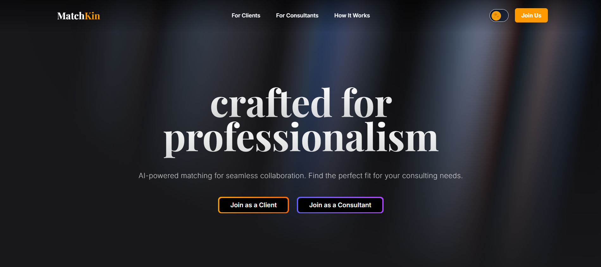

# <div align="center">✨ MATCHKIN REDESIGN✨</div>

<div align="center">
  
</div>

<div align="center">
  
```ascii
  __  __       _       _     _    _         ____          _           _             
 |  \/  | __ _| |_ ___| |__ | | _(_)_ __   |  _ \ ___  __| | ___  ___(_) __ _ _ __  
 | |\/| |/ _` | __/ __| '_ \| |/ / | '_ \  | |_) / _ \/ _` |/ _ \/ __| |/ _` | '_ \ 
 | |  | | (_| | || (__| | | |   <| | | | | |  _ <  __/ (_| |  __/\__ \ | (_| | | | |
 |_|  |_|\__,_|\__\___|_| |_|_|\_\_|_| |_| |_| \_\___|\__,_|\___||___/_|\__, |_| |_|
                                                                        |___/                                                             
```

</div>

<p align="center">
  <a href="https://matchkin-redesigned.vercel.app/" target="_blank">
    
  </a>
</p>

<div align="center">
  <strong>🚀 Connecting AI Consultants with Businesses Through Intelligent Matching 🚀</strong>
</div>

<br/>

<div align="center">
  <a href="https://nextjs.org/">
    
  </a>
  <a href="https://www.typescriptlang.org/">
    
  </a>
  <a href="https://tailwindcss.com/">
    
  </a>
  <a href="https://www.framer.com/motion/">
    
  </a>
  <a href="https://zod.dev/">
    
  </a>
  <a href="https://react-hook-form.com/">
    
  </a>
  
  <br/>
  <br/>
  
  <a href="https://matchkin-redesigned.vercel.app/">
    
  </a>
  <a href="https://matchkin-redesigned.vercel.app/">
    
  </a>
  <a href="https://github.com/yourusername/matchkin-landing/pulls">
    
  </a>
  <a href="LICENSE">
    
  </a>
</div>

<p align="center">
  <a href="#-live-demo">Live Demo</a> •
  <a href="#-overview">Overview</a> •
  <a href="#-features">Features</a> •
  <a href="#%EF%B8%8F-tech-stack">Tech Stack</a> •
  <a href="#-getting-started">Getting Started</a> •
  <a href="#-project-structure">Project Structure</a>
</p>

---

## 🌐 Live Demo

Check out the live demo of Matchkin deployed on Vercel:

<div align="center">
  <a href="https://matchkin-redesigned.vercel.app/" target="_blank">
    
  </a>
</div>

### Key Pages:
- [Home Page](https://matchkin-redesigned.vercel.app/)
- [Client Onboarding](https://matchkin-redesigned.vercel.app/onboarding/client)
- [Consultant Onboarding](https://matchkin-redesigned.vercel.app/onboarding/consultant)

---

## 🌠 Overview

**Matchkin** revolutionizes how businesses find AI talent. Our platform uses advanced algorithms to match companies with the perfect AI consultants for their specific needs.

> 💡 **Vision**: To create the world's most efficient marketplace for AI expertise.

Our landing page showcases:
- 🎨 **Stunning visual design** with aurora effects and 3D elements
- 🔄 **Smooth animations** powered by Framer Motion
- 📱 **Fully responsive** layouts for all devices
- 🧙‍♂️ **Intelligent onboarding** flows for both clients and consultants

---

## 🌟 Features

<div align="center">
  <table>
    <tr>
      <td>
        <h3>🎭 Interactive UI</h3>
        <p>Stunning animations and transitions create an engaging user experience</p>
      </td>
      <td>
        <h3>📝 Multi-step Forms</h3>
        <p>Intuitive onboarding for both clients and consultants</p>
      </td>
    </tr>
    <tr>
      <td>
        <h3>📱 Responsive Design</h3>
        <p>Beautiful on all devices from mobile to desktop</p>
      </td>
      <td>
        <h3>🔍 Smart Validation</h3>
        <p>Real-time feedback with intelligent form validation</p>
      </td>
    </tr>
    <tr>
      <td>
        <h3>🌈 Modern Aesthetic</h3>
        <p>Aurora backgrounds and gradient accents</p>
      </td>
      <td>
        <h3>📋 Waitlist System</h3>
        <p>Capture early interest with our waitlist functionality</p>
      </td>
    </tr>
  </table>
</div>

---

## 🛠️ Tech Stack

<table align="center">
  <tr>
    <td align="center" width="96">
      <a href="https://nextjs.org">
        
      </a>
      <br>Next.js 15
    </td>
    <td align="center" width="96">
      <a href="https://www.typescriptlang.org">
        
      </a>
      <br>TypeScript
    </td>
    <td align="center" width="96">
      <a href="https://tailwindcss.com">
        
      </a>
      <br>Tailwind
    </td>
    <td align="center" width="96">
      <a href="https://react-hook-form.com">
        
      </a>
      <br>React Hook Form
    </td>
    <td align="center" width="96">
      <a href="https://zod.dev">
        
      </a>
      <br>Zod
    </td>
    <td align="center" width="96">
      <a href="https://www.framer.com/motion">
        
      </a>
      <br>Framer Motion
    </td>
  </tr>
</table>

### ✨ Key Libraries

- **UI Components**: Custom-built with modern design patterns
- **Form Validation**: Zod + React Hook Form
- **Icons**: Tabler Icons
- **Animations**: Framer Motion
- **Styling**: Tailwind CSS with custom plugins

---

## 🚀 Getting Started

### Prerequisites

- Node.js 18+ and npm/yarn
- Git

### ⚡ Quick Start

```bash
# Clone the repository
git clone https://github.com/yourusername/matchkin-landing.git

# Navigate to the project
cd matchkin-landing

# Install dependencies
npm install

# Start the development server
npm run dev
```

<details>
<summary>🔧 Available Scripts</summary>
<br>

| Command | Description |
|---------|-------------|
| `npm run dev` | Start development server |
| `npm run build` | Build for production |
| `npm run start` | Start production server |
| `npm run lint` | Run ESLint |

</details>

Visit [http://localhost:3000](http://localhost:3000) to see the magic! ✨

---

## 📂 Project Structure

```
matchkin-landing/
├── 📁 public/                 # Static assets
├── 📁 src/
│   ├── 📁 app/                # Next.js App Router pages
│   │   ├── 📁 api/            # API routes
│   │   │   └── 📁 waitlist/   # Waitlist API endpoint
│   │   ├── 📁 onboarding/     # Onboarding flows
│   │   │   ├── 📁 client/     # Client onboarding
│   │   │   └── 📁 consultant/ # Consultant onboarding
│   ├── 📁 components/         # React components
│   │   ├── 📁 layout/         # Layout components (Header, Footer)
│   │   ├── 📁 providers/      # Context providers
│   │   ├── 📁 sections/       # Page sections (Hero, Features, etc.)
│   │   └── 📁 ui/             # Reusable UI components
│   ├── 📁 data/               # Static data and content
│   └── 📁 lib/                # Utility functions and helpers
├── 📄 .gitignore              # Git ignore file
├── 📄 eslint.config.mjs       # ESLint configuration
├── 📄 next.config.ts          # Next.js configuration
├── 📄 package.json            # Project dependencies
├── 📄 postcss.config.mjs      # PostCSS configuration
├── 📄 tailwind.config.js      # Tailwind CSS configuration
└── 📄 tsconfig.json           # TypeScript configuration
```

---

<div align="center">
  <p>Made with ❤️ by HackStyx</p>
</div>
